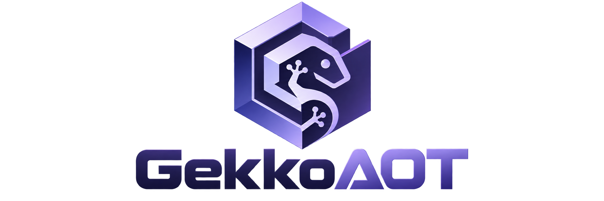

<p align="center">
  
</p>

<h1 align="center">GekkoAOT</h1>

<p align="center">
  <strong>Static GameCube recompilation and native compatibility runtime</strong>
</p>

<p align="center">
  PowerPC analysis · LLVM AOT · AuroraGX · Native runtime
</p>

---

GekkoAOT is a standalone GameCube static-recompilation frontend and native PC runtime.

> [!WARNING]
> **GekkoAOT is pre-alpha software.** Compatibility is incomplete and title-dependent.
> Booting, reaching a menu or rendering early 3D does not mean a title is fully playable.

The current project focuses on a practical LLVM AOT execution pipeline with native runtime services and AuroraGX integration, while the long-term architecture aims to progressively turn GameCube PowerPC software into native host applications.

## Current v0.0.1 architecture

The v0.0.1 architecture is intentionally small:

```text
GameCube disc (ISO/GCM/RVZ/WIA/WBFS/GCZ/...)
        |
        v
 encounter/nod
        |
        +--> boot.bin / bi2.bin / fst.bin / main.dol
        |
        v
 DolRecomp (PowerPC -> LLVM AOT objects)
        |
        v
 GekkoAOT per-game module
        |
        v
 GekkoAOT native runtime
   |        |        |
   |        |        +--> native SDK/HLE services
   |        +-----------> native HW/DSP services
   +--------------------> AuroraGX retail FIFO renderer
```

There is no emulator chassis in the normal runtime path. The GUI launches `gekkoaotctl`, a native C++ controller. Normal build/run orchestration is native C++; Python is only used by optional development tooling such as adaptive PGO/CrossGameDB helpers, not as a runtime dependency for the recompiled game.


## Current compatibility snapshot

The table below records the furthest state observed in the current development snapshot. It is not a compatibility guarantee.

| Title | Region / ID | Current state | Notes |
| --- | --- | --- | --- |
| Harry Potter and the Sorcerer's Stone | USA / `GHLE69` | **Gameplay / early 3D** | Reaches gameplay; 3D rendering is visibly glitched. |
| Harry Potter and the Chamber of Secrets | USA / `GHSE69` | **Menu** | Reaches the menu, then remains on the loading screen before gameplay. |
| Nintendo Developer Demo | developer sample | **Working** | Current tested demo path completes without a known blocker. |
| Super Mario Sunshine | USA / `GMSE01` | **Boot** | Boots; later execution is not yet considered working. |
| Mario Kart: Double Dash!! | USA / `GM4E01` | **Menu** | Reaches the menu, then remains on the loading screen before gameplay. |
| Medal of Honor: Frontline | USA / `GMFE69` | **Boot / early execution** | Boots with several compatibility/rendering glitches. |

For detailed status definitions and per-title notes, see [`docs/COMPATIBILITY.md`](docs/COMPATIBILITY.md).

## Long-term architecture

The current v0.0.1 pipeline is the practical foundation. The long-term architecture is organized around three major components:

```text
GekkoAOT
|
+-- GekkoTranslate
|   +-- PowerPC disassembly
|   +-- CFG / data-flow reconstruction
|   +-- ABI / SDA / SDA2 analysis
|   +-- DOL + REL whole-program reconstruction
|   +-- function / callback / indirect-call recovery
|   +-- optional type and structure recovery
|   +-- direct LLVM backend
|   +-- reconstructed portable C++ backend
|   `-- native x86-64 / ARM64 code generation
|
+-- GCINE
|   `-- native GameCube compatibility runtime
|
`-- AuroraGX
    `-- native GX graphics implementation
```

The objective is not to permanently emulate a complete GameCube machine. GekkoAOT should progressively replace guest-side execution and hardware emulation with statically resolved native code and native compatibility services.

### GekkoTranslate

`GekkoTranslate` is the planned static translation and automatic program-reconstruction frontend.

Its long-term goal is to **disassemble GameCube PowerPC binaries, reconstruct their program structure automatically, and transform them into highly optimized native host code**.

C++ itself is not x86-specific. The intended architecture therefore has two complementary output paths:

```text
PowerPC DOL / ELF / REL
          |
          v
      Disassembly
          |
          v
 CFG / data-flow / ABI analysis
          |
          v
      GekkoAOT IR
          |
          +-----------------------------+
          |                             |
          v                             v
 Direct LLVM backend            C++ reconstruction
          |                             |
          v                             v
 LLVM IR + optimization             Clang / LLVM
          |                             |
          +--------------+--------------+
                         |
                         v
                native x86-64 / ARM64
```

#### Direct LLVM path

The direct path is intended to remain the lowest-overhead and highest-fidelity compiler path:

```text
PPC
 |
 v
GekkoAOT IR
 |
 v
LLVM IR
 |
 v
-O3 / LTO / PGO
 |
 v
native machine code
```

This path does not require generated C++.

#### Automatic C++ reconstruction

The second path aims to reconstruct portable C++ automatically from the PowerPC program:

```text
main.dol + REL modules
        |
        v
PowerPC disassembly
        |
        v
whole-program analysis
        |
        v
control-flow reconstruction
        |
        v
data-flow / ABI / type recovery
        |
        v
reconstructed portable C++
        |
        v
Clang / LLVM
        |
        v
native x86-64 / ARM64 executable
```

The generated C++ is not intended to reproduce unavailable original source code. It is an independently reconstructed representation of equivalent behavior derived from executable analysis.

An early low-level result may still look like:

```cpp
void fn_80128450(PPCContext* ctx)
{
    const uint32_t object = ctx->gpr[3];
    // translated PPC semantics...
}
```

As reconstruction improves, the same logic may become structurally closer to:

```cpp
void Player_Update(Player* player)
{
    player->position.x += player->velocity.x;
    player->position.y += player->velocity.y;

    if (player->state & STATE_JUMPING)
        Player_UpdateJump(player);
}
```

The long-term target is not limited to instruction translation: GekkoTranslate should progressively reconstruct higher-level program structure where analysis is reliable.

```text
Level 1
PPC instructions
    |
    v
semantically equivalent LLVM/native operations

Level 2
basic blocks + functions
    |
    +-- loops
    +-- if / else
    +-- switch recovery
    `-- direct calls

Level 3
whole-program reconstruction
    |
    +-- function relationships
    +-- callbacks
    +-- indirect-call targets
    +-- structures/types where inferable
    +-- native SDK interfaces
    `-- readable portable C++
```

Level 3 is intentionally ambitious and should be developed progressively rather than required for basic compatibility.

### Whole-program DOL + REL reconstruction

GekkoTranslate should eventually treat a title as one global program:

```text
main.dol
   |
   +-- REL A
   +-- REL B
   +-- REL C
   `-- runtime references
        |
        v
 global symbol database
        |
        v
 global call graph
        |
        v
 GekkoAOT IR
        |
        +-------------------+
        |                   |
        v                   v
     LLVM IR          reconstructed C++
        |                   |
        +---------+---------+
                  |
                  v
          whole-program LTO
                  |
                  v
          native executable
```

This gives LLVM visibility across modules and allows more callbacks, function pointers and indirect branches to become ordinary native calls.

### Removing the guest dispatcher

An early recompilation path may still require runtime lookup:

```text
PPC PC -> lookup(pc) -> function pointer -> AOT function
```

The target is to replace known destinations with native calls:

```text
CallGuestFunction(0x80123450)
            |
            v
      fn_80123450()
            |
            v
        native call
```

The dispatcher should eventually remain only for unresolved or genuinely dynamic cases such as:

- unresolved indirect branches;
- runtime-loaded REL targets;
- unproven function pointers;
- dynamic callbacks;
- exception vectors;
- unsupported code;
- debugging or compatibility fallback.

### GCINE

`GCINE` is the planned native GameCube compatibility environment.

```text
                GCINE
                  |
     +------------+-------------+
     |            |             |
     v            v             v
     OS        Hardware         I/O
     |            |             |
 threads          PI            DVD
 mutexes          MI            SI
 queues           VI            EXI
 alarms           AI            input
 timers           DSP
 interrupts       GX
```

Typical native replacement paths are:

```text
OSCreateThread  -> native scheduler / host threads
OSMutex         -> native synchronization
OSAlarm         -> native timer system
OSGetTime       -> native timing source

GX*             -> AuroraGX
DSP*            -> native DSP runtime
AI*             -> native audio backend
DVD*            -> nod / asynchronous host I/O
SI*             -> native input system
EXI*            -> native device implementation
```

The implementation may be completely native while still preserving the GameCube-visible semantics expected by games.

### AuroraGX

The earlier conceptual `GXVK` layer is superseded by AuroraGX:

```text
Game code
   |
   v
GX calls / WGPIPE
   |
   v
FIFO decode
   |
   v
AuroraGX
   |
   v
host graphics API
   |
   v
GPU
```

AuroraGX is intended to own the normal graphics path without requiring a Dolphin graphics backend.

### Native host threading model

A possible logical worker layout is:

```text
Core 0
`-- Guest PPC / LLVM AOT
    +-- game logic
    +-- OS scheduler
    +-- MMIO
    `-- IRQ delivery

Core 1
`-- GX worker
    +-- WGPIPE
    +-- FIFO decode
    `-- AuroraGX submission

Core 2
`-- DSP / audio
    +-- DSP execution
    +-- mixer
    `-- host audio output

Core 3+
+-- nod / DVD async
+-- texture work
+-- shader compilation
`-- miscellaneous workers
```

These are logical worker roles, not mandatory fixed CPU affinities. The host scheduler should normally remain free to place threads unless profiling proves explicit affinity useful.

### Native memory specialization

Generic guest memory access may initially look like:

```text
PPC access
   |
   v
Read32 / Write32
   |
   +-- guest address translation
   +-- region checks
   `-- endian conversion
   |
   v
host RAM
```

When analysis proves that an address is a normal MEM1/MEM2 access, GekkoTranslate should specialize it toward:

```text
known RAM access
      |
      v
direct host load/store
      |
      v
required endian operation only
```

MMIO for PI, MI, VI, DSP, AI, DI, EXI, SI, GX FIFO and other hardware remains interceptable.

### SDK/native call recognition

Known SDK/library functions can be resolved to GCINE implementations:

```text
PowerPC OSGetTime
       |
       v
SDK AutoResolver
       |
       v
GCINE::OSGetTime()
```

The same approach can progressively cover:

```text
OS*
GX*
DVD*
AI*
DSP*
SI*
EXI*
VI*
```

### Performance philosophy

Performance work should prioritize removing unnecessary translation and compatibility layers before focusing on small local optimizations:

```text
interpreter                  -> remove
JIT dispatch                 -> remove
runtime PPC decode           -> remove
known indirect calls         -> resolve
known SDK code               -> replace
generic guest helpers        -> specialize/remove
legacy GX backend            -> AuroraGX
legacy DSP path              -> native DSP
blocking disc I/O            -> asynchronous workers
```

Strictly zero overhead is not realistic because the GameCube and a modern host differ in endianness, memory model, graphics APIs, timing and devices.

The target is to minimize unnecessary CPU-emulation overhead in the normal execution path.

### Long-term native pipeline

```text
                  GameCube title
                       |
       +---------------+---------------+
       |               |               |
       v               v               v
    main.dol           REL             ELF
       |               |               |
       +---------------+---------------+
                       |
                       v
                Binary analyzer
                       |
       +---------------+---------------+
       |               |               |
       v               v               v
 CFG recovery     SDK resolver     relocations
       |               |               |
       +---------------+---------------+
                       |
                       v
                 GekkoAOT IR
                       |
          +------------+------------+
          |                         |
          v                         v
     Direct LLVM             C++ reconstruction
          |                         |
          v                         v
     native code               Clang / LLVM
          |                         |
          +------------+------------+
                       |
                       v
              native executable
                       |
        +--------------+--------------+
        |              |              |
        v              v              v
      GCINE         AuroraGX      native DSP
        |              |              |
        +--------------+--------------+
                       |
                       v
                     Host OS
```

## What is included

- Qt 6 GUI with **Open Game**, **Play**, **Stop**, graphics/input settings and log/progress views.
- Native `gekkoaotctl` controller.
- Native nod disc reader (`gekkoaot-native-disc`).
- DolRecomp LLVM AOT build pipeline.
- GekkoAOT-owned CPU/module ABI.
- Native MEM1/MEM2, boot, scheduler/HLE, hardware, DSP, input and disc services.
- Direct AuroraGX FIFO bridge.
- Per-game module cache under `.gekkoaot/cache/modules/`.
- Pinned external source revisions for reproducible builds.

## Pinned dependencies

- DolRecomp: `71ce7f97419b1bb1ba9a9596c41507f6629e0fb0`
- Aurora: `7f2801cd0133c9333eadb4e2e6b24100c328d328`
- encounter/nod: `v2.0.0-alpha.12`

The controller clones only DolRecomp and Aurora into `.gekkoaot/src/` when they are not already present. nod is consumed as a CMake package by the native host.

## Linux build

Dependencies: CMake, Ninja, Git, Qt 6 Widgets, a C/C++ compiler and LLVM 19 or 20 for DolRecomp's LLVM backend.

```bash
./build-linux.sh
./bin/gekkoaot
```

If LLVM is not in CMake's default search path, set it in **Advanced -> LLVM** or configure with the appropriate `LLVM_DIR`.

## Windows build

Windows x86-64 uses Visual Studio 2022 / MSVC.

Required on the host:

- Visual Studio 2022 / Build Tools with **Desktop development with C++**;
- CMake;
- Git;
- Python 3 for the first-time automatic Qt bootstrap.

Then simply run:

```bat
build-windows.cmd
```

If Qt is missing, the build helper automatically installs the pinned **Qt 6.8.3 MSVC 2022 x64** package under `.deps/Qt/`. The final tree under `dist/GekkoAOT/` is deployed with the Qt DLLs and `platforms/qwindows.dll`, so `gekkoaot.exe` does not require a separate global Qt installation.

You can also bootstrap Qt explicitly:

```powershell
powershell -ExecutionPolicy Bypass -File .\scripts\install-qt6-windows.ps1
```

Or point GekkoAOT to an existing Qt installation with `GEKKOAOT_QT_DIR`.

## Portable releases

Official end-user releases bundle the build/runtime pieces needed by normal
Play.

**Windows x86-64 ZIP:** Qt + platform plugins + VC runtime, prebuilt
DolRecomp/AuroraGX, patched DolRecomp source, portable CMake/Ninja/Zig. Git and
Visual Studio are not required on the target machine.

**Linux x86-64 AppImage:** Qt and application libraries plus the same prebuilt
engine and portable CMake/Ninja/Zig toolchain. Git and a system compiler are not
required for normal Play.

The operating-system kernel and hardware drivers remain host requirements.

## GUI launch flow

1. Start `./bin/gekkoaot`.
2. **File -> Open Game...** and select an ISO/GCM/RVZ/WIA/WBFS/GCZ image.
3. Press **Play** (opening a new image can auto-play as well).
4. The GUI runs the native controller directly:
   - builds/reuses the pinned toolchain,
   - extracts the disc through nod,
   - compiles `main.dol` with DolRecomp LLVM,
   - links the GekkoAOT module,
   - starts `gekkoaot-native-run`,
   - sends the retail GX FIFO directly to AuroraGX.

On X11/XWayland the Aurora SDL window is reparented into the Qt Game View when the platform exposes an X11 window handle. Pure Wayland uses Aurora's native top-level window.

## Command-line controller

The same pipeline is available without the GUI:

```bash
GEKKOAOT_ISO='/path/to/game.rvz' ./bin/gekkoaotctl run
```

Useful actions:

```bash
./bin/gekkoaotctl status
GEKKOAOT_ISO='/path/to/game.rvz' ./bin/gekkoaotctl inspect
GEKKOAOT_ISO='/path/to/game.rvz' ./bin/gekkoaotctl compile
GEKKOAOT_ISO='/path/to/game.rvz' ./bin/gekkoaotctl run
GEKKOAOT_ISO='/path/to/game.rvz' ./bin/gekkoaotctl pgo
./bin/gekkoaotctl clean
```

### LLVM PGO

With the LLVM backend selected, **Tools -> Train PGO** (or the Advanced-panel **Train PGO** button) builds an instrumented module and launches the game. Exercise representative scenes, then press **Stop**. GekkoAOT exits the runtime cleanly, merges the generated profiles with `llvm-profdata`, validates them, builds a PGO-use module, and automatically uses the cumulative profile on later Play launches. Re-run training in different scenes to improve coverage.

Set `GEKKOAOT_LLVM_PROFDATA` if `llvm-profdata` cannot be discovered automatically. `GEKKOAOT_PGO_ACCUMULATE=0` disables cumulative training for one session, and `GEKKOAOT_PGO_AUTO_USE=0` launches the normal non-PGO module without deleting the trained profile.


## Release process

`version.txt` is the canonical project version.

On `main`, GitHub Actions builds Linux x86_64 and Windows x86_64. When the version in `version.txt` does not already have a matching GitHub release, the release workflow builds, stages and publishes:

```text
GekkoAOT-vX.Y.Z-Linux-x86_64.tar.gz
GekkoAOT-vX.Y.Z-Linux-x86_64.tar.gz.sha256
GekkoAOT-vX.Y.Z-Windows-x86_64.zip
GekkoAOT-vX.Y.Z-Windows-x86_64.zip.sha256
```

Pre-1.0 releases are marked as prereleases.

Release Please is used to prepare later version/changelog pull requests from Conventional Commits. See [`docs/RELEASING.md`](docs/RELEASING.md) for the complete workflow.

## Repository layout

- `src/` - Qt GUI.
- `tools/gekkoaotctl.cpp` - native build/run controller.
- `tools/module_meta.cpp` - native module metadata generator.
- `runtime/native/` - standalone host and nod disc reader.
- `runtime/module/` - per-game AOT module linker.
- `runtime/gx/aurora/` - direct AuroraGX bridge.
- `runtime/gx/host/` - renderer plugin ABI used by the host.
- `runtime/os`, `runtime/sdk`, `runtime/hw`, `runtime/dsp` - native GameCube services.
- `crossgame-db/` - cross-title compatibility, profiling and shared knowledge.

Future revisions may introduce dedicated `GekkoTranslate` and `GCINE` top-level components as those subsystems become independent enough to justify separate boundaries.

## Long-term roadmap

### Phase 1 - Native compatibility foundation

- [ ] Stabilize native OS/scheduler/timers/interrupts.
- [ ] Stabilize native PI/MI/SI/EXI/DI and memory services.
- [ ] Stabilize native DSP/audio.
- [ ] Stabilize AuroraGX WGPIPE/FIFO rendering.
- [ ] Keep nod as the asynchronous DVD/image backend.

### Phase 2 - Reduce guest/runtime overhead

- [ ] Replace known SDK calls with GCINE-native calls.
- [ ] Resolve direct AOT calls statically.
- [ ] Reduce dispatcher use.
- [ ] Specialize proven MEM1/MEM2 accesses.
- [ ] Keep MMIO interception only where hardware semantics require it.

### Phase 3 - Whole-program GekkoTranslate

- [ ] Build global DOL + REL symbol and call graphs.
- [ ] Resolve function pointers and callbacks where provable.
- [ ] Add a canonical GekkoAOT IR.
- [ ] Lower the IR directly to LLVM.
- [ ] Apply LTO, PGO, inlining, devirtualization and layout optimization.

### Phase 4 - Automatic C++ reconstruction

- [ ] Recover structured control flow.
- [ ] Recover loops, `if`/`else` and `switch` constructs.
- [ ] Recover function relationships and callbacks.
- [ ] Infer types/structures where reliable.
- [ ] Emit portable reconstructed C++.
- [ ] Compile reconstructed C++ with Clang/LLVM.
- [ ] Validate reconstructed behavior against the direct LLVM backend.

### Phase 5 - Additional native targets/features

- [ ] x86-64 host target.
- [ ] ARM64 host target.
- [ ] WebAssembly target.
- [ ] WebGPU target.
- [ ] Widescreen infrastructure.
- [ ] Frame-rate decoupling/unlocking infrastructure.
- [ ] Modern input and keyboard/mouse support.

---

## v0.0.1 compatibility goal

v0.0.1 keeps the same user-facing one-click launch intent as the former native-GX launcher: a disc image enters the pipeline and the standalone host starts the game. The implementation is now owned by GekkoAOT instead of relying on runtime patch injection.

Because game compatibility depends on the exact title and host GPU/driver, release validation should include at least one cold build and one cache-hit launch for each supported test game before publishing a binary release.


## Clean-room reconstruction note

GekkoAOT is intended to use independently implemented compatibility and reconstruction code.

Documentation, executable analysis, hardware behavior, public research and behavioral testing may be used to understand interfaces and semantics. Proprietary Nintendo source code, libraries, object files or copyrighted SDK resources are not intended to become part of distributable GekkoAOT code.

The planned C++ reconstruction backend is intended to reconstruct equivalent behavior from executable analysis, not reproduce unavailable original source code.

## Long-term target

A mature GekkoAOT title should increasingly resemble:

```text
                Native game
                    |
         +----------+-----------+
         |          |           |
         v          v           v
       CPU         GPU         DSP
    x86-64/ARM64  AuroraGX     native
         |          |           |
         +----------+-----------+
                    |
                  GCINE
                    |
                 Host OS
```

At that stage, game logic executes as native machine code, known calls are direct, most dispatcher overhead is gone, SDK functions use native implementations, graphics use AuroraGX, DSP/audio run independently, and DOL/REL modules can be optimized as one program.

> **Static GameCube recompilation plus automatic program reconstruction: PowerPC binaries analyzed into native LLVM or reconstructed portable C++, backed by GCINE, AuroraGX, native DSP/audio and whole-program optimization.**
