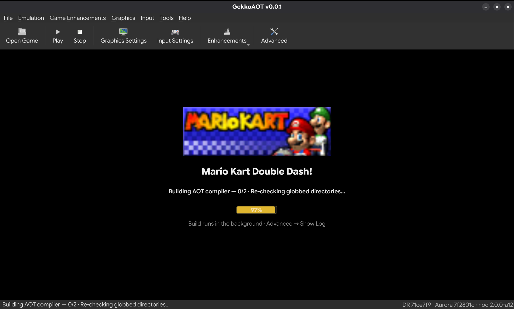
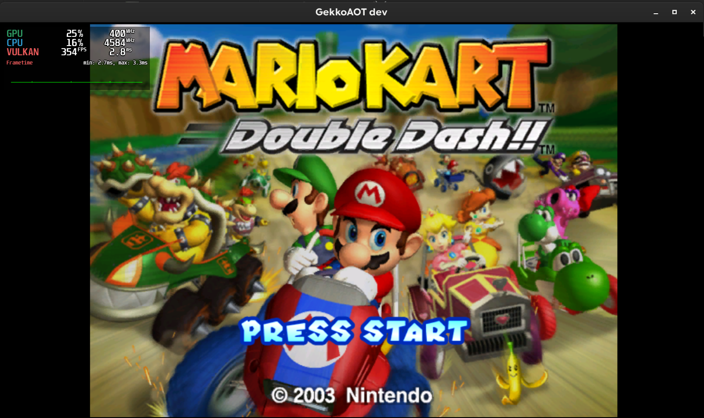
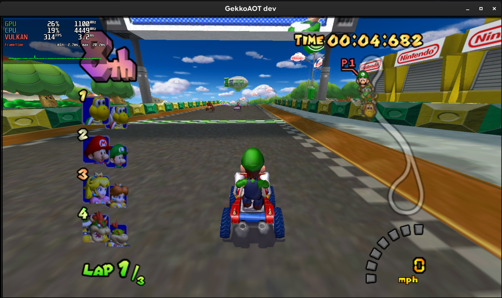
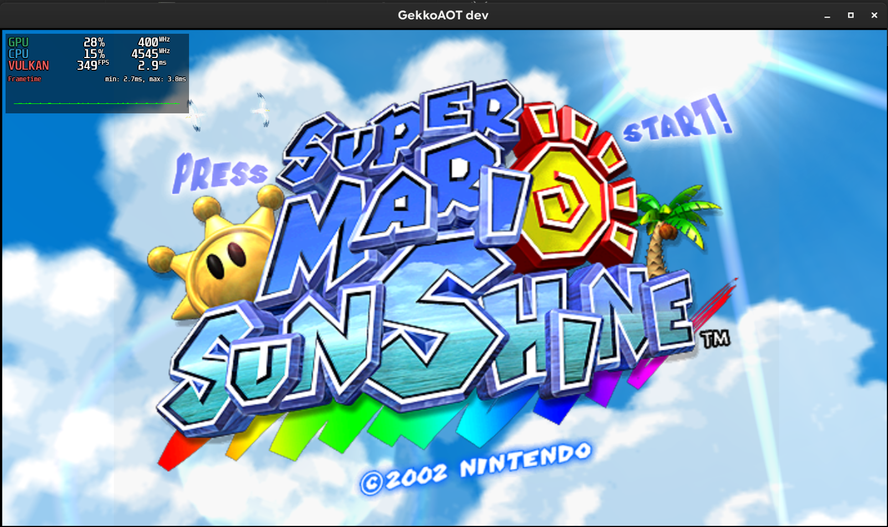
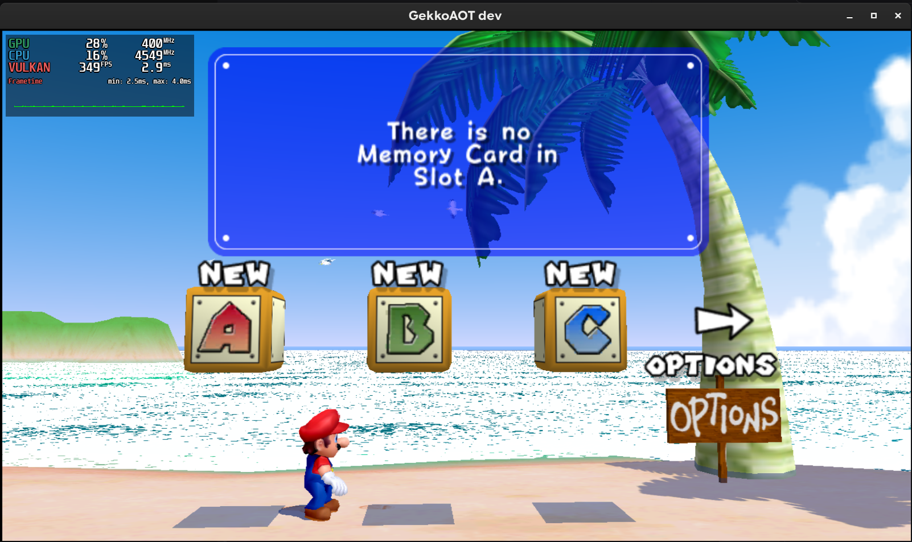

<p align="center">
  
</p>

<h1 align="center">GekkoAOT</h1>

<p align="center">
  <strong>Static GameCube recompilation and native compatibility runtime</strong>
</p>

<p align="center">
  PowerPC → LLVM AOT · NativeOS · NativeVFS · AuroraGX · Native DSP
</p>

<p align="center">
  <a href="https://github.com/ant0-blase/GekkoAOT/actions/workflows/ci.yml">
    
  </a>
  <a href="https://github.com/ant0-blase/GekkoAOT/releases">
    
  </a>
  <a href="LICENSE">
    
  </a>
  
  
</p>

<p align="center">
  <a href="#overview">Overview</a> ·
  <a href="#architecture">Architecture</a> ·
  <a href="#screenshots">Screenshots</a> ·
  <a href="#compatibility">Compatibility</a> ·
  <a href="#downloads--build">Downloads & Build</a> ·
  <a href="#roadmap">Roadmap</a> ·
  <a href="#documentation">Docs</a>
</p>

---

> [!WARNING]
> **GekkoAOT is pre-alpha software.** Compatibility is incomplete and title-dependent.
> Reaching a menu or an early 3D scene does **not** imply full playability.

## Overview

GekkoAOT is a standalone GameCube static-recompilation frontend and native PC runtime.

Instead of permanently running a complete console emulator around the game, the project is built around a different direction:

1. read the GameCube disc with **encounter/nod**;
2. analyze and recompile PowerPC code ahead of time with **DolRecomp + LLVM**;
3. execute the generated per-game native module inside the **GekkoAOT runtime**;
4. progressively replace GameCube OS, hardware, filesystem, DSP and graphics services with native host implementations;
5. send the retail GX/FIFO path to **AuroraGX**.

### At a glance

| Area | Current implementation |
| --- | --- |
| **CPU** | PowerPC → LLVM AOT through pinned DolRecomp |
| **Runtime** | GekkoAOT-owned CPU/module ABI, NativeOS and hardware services |
| **Graphics** | AuroraGX through the retail GX/WGPIPE/FIFO path |
| **Disc / VFS** | encounter/nod + NativeVFS |
| **Audio / DSP** | Native DSP services, AX/JAudio work, LLE fallback |
| **Input** | SDL3 keyboard / gamepad / joystick path |
| **Frontend** | Qt 6 GUI + native `gekkoaotctl` controller |
| **Hosts** | Windows x86-64 and Linux x86-64 |

There is no Dolphin Core/System chassis in the normal runtime path. Python is only used by optional development tooling such as adaptive PGO and CrossGameDB helpers.

## Screenshots

### GekkoAOT frontend

<p align="center">
  
</p>

### Mario Kart: Double Dash!!

<p align="center">
  
</p>

<p align="center">
  
</p>

> Reaches **gameplay / early 3D**. Rendering is still visibly incomplete.

### Super Mario Sunshine

<p align="center">
  
</p>

<p align="center">
  
</p>

> Reaches **gameplay / early 3D**. Graphics/runtime correctness is still incomplete.


## Architecture

```text
                         GameCube disc
                              |
                              v
                        encounter / nod
                              |
               +--------------+--------------+
               |              |              |
               v              v              v
            boot.bin        fst.bin       main.dol
                                             |
                                             v
                                DolRecomp + LLVM AOT
                                             |
                                             v
                                  per-game native module
                                             |
                                             v
                                  GekkoAOT native runtime
                  +------------------+-------------------+
                  |                  |                   |
                  v                  v                   v
               NativeOS         Native HW/DSP        NativeVFS
                  |                  |                   |
                  +------------------+-------------------+
                                             |
                                             v
                                      AuroraGX / GX FIFO
                                             |
                                             v
                                           Host
```

The current runtime owns the host-facing CPU state/module ABI, native GameCube services, disc/cache orchestration and AuroraGX bridge.

More detail: [Architecture](docs/ARCHITECTURE.md) · [Native VFS](docs/NATIVE_VFS.md) · [Roadmap](docs/ROADMAP.md)

## Technical deep dive

GekkoAOT is intentionally more than a frontend around an existing emulator core. The project is split into a static compiler path and a native compatibility/runtime path, with the goal of moving as much work as possible from runtime emulation into ahead-of-time translation and native host services.

### PowerPC → native AOT pipeline

The current compiler path is:

```text
main.dol / REL / executable code
             |
             v
       PowerPC analysis
             |
             v
   DolRecomp LLVM backend
             |
             +--> static function lowering
             +--> native re-entry boundaries
             +--> execution-budget barriers
             +--> direct SDK/HLE intercept lowering
             +--> computed CTR fencing
             +--> PGO instrumentation/use
             |
             v
       LLVM IR / objects
             |
             v
     per-game native module
             |
             v
      GekkoAOT runtime ABI
```

The long-term objective is to make ordinary known control flow become ordinary host control flow. A runtime dispatcher should remain only where targets are genuinely dynamic or unresolved.

### Guest/host ABI boundaries

A recompiled function cannot freely jump into a native service without first materializing architectural PowerPC state. GekkoAOT therefore treats native service boundaries as explicit ABI transitions.

Important state includes:

- GPRs and control state;
- CR/LR/CTR/XER;
- SRR0/SRR1 around exceptions;
- GQR state;
- FPR0–31;
- paired-single PS0–31;
- FPSCR;
- MSR[EE] and interrupt-visible state;
- cycle accounting before returning to the dispatcher/runtime.

For computed `bctr` / `bctrl` control flow, GekkoAOT fences architectural state before routing the target so stale host temporaries cannot leak across dynamic call edges.

### NativeOS and guest-AOT coexistence

NativeOS provides host-side implementations for substantial parts of the GameCube OS surface, including:

- scheduler and thread selection;
- thread creation/lifecycle;
- ready and wait queues;
- priorities, suspend/resume and sleep/wakeup;
- mutexes and condition variables;
- message queues;
- alarms/timers;
- `OSContext` handling;
- FPU context helpers.

This is **not** an all-or-nothing HLE switch. GekkoAOT can leave small retail SDK leaves in guest AOT when executing the original PPC semantics is more accurate or safer.

For example, interrupt leaves such as:

```text
OSDisableInterrupts
OSEnableInterrupts
OSRestoreInterrupts
```

can remain recompiled PPC while higher-level scheduler/context services use native implementations. MSR[EE] transition fences and interrupt-entry boundaries keep asynchronous events observable at correct PPC architectural points.

### SDK AutoResolver

The runtime/compiler can identify SDK entrypoints structurally and emit a per-game native-intercept manifest.

```text
DOL code
   |
   v
SDK scanner
   |
   +--> exact normalized signatures
   +--> tiny-leaf ABI proofs
   +--> call-target / adjacency proofs
   +--> context/scheduler semantic proofs
   |
   v
native-intercepts manifest
   |
   v
compile-time direct lowering
```

The policy is designed to fail closed: an uncertain match should remain guest AOT rather than becoming an unsafe native replacement.

Current resolver work covers families such as:

```text
OSContext
interrupts
alarms
message queues
mutexes / conditions
scheduler / threads
time / tick helpers
```

### Memory model

GameCube software expects console-visible memory semantics that do not map 1:1 onto a modern desktop process.

Current runtime work includes:

```text
reported MEM1     24 MiB
host MEM1 backing 32 MiB compatibility allocation
FakeVMEM          0x7e000000 + 32 MiB
MMIO              intercepted separately
locked cache      dedicated guest-visible handling
```

The goal is to specialize proven RAM accesses toward direct host loads/stores while retaining explicit handlers for hardware-visible regions.

Conceptually:

```text
generic guest access
       |
       +--> MEM1/MEM2/FakeVMEM -> direct/native memory path
       |
       +--> MMIO              -> device/register semantics
       |
       +--> WGPIPE            -> GX FIFO
       |
       `--> locked cache      -> LC semantics
```

### Hardware runtime

GekkoAOT owns GameCube-facing service work for:

```text
CP  Command Processor
PE  Pixel Engine
PI  Processor Interface
MI  Memory Interface
AI  Audio Interface
DI  Disc Interface
EXI External Interface
SI  Serial Interface
VI  Video Interface
LC  Locked Cache
```

Interrupt routing is modeled through the guest-visible PI/VI/etc. state rather than treating device events as arbitrary host callbacks.

### Clock domains and frame scheduling

CPU execution and hardware time are deliberately separated.

The runtime can let the AOT CPU run uncapped while hardware-visible timing follows host realtime:

```text
AOT CPU       -> execution as fast as possible
VI            -> realtime domain
Time Base     -> realtime domain
Decrementer   -> realtime domain
DSP / AI      -> realtime domain
presentation  -> independent host frame scheduler
```

This separation is important for future FPS unlocking: increasing host presentation rate must not blindly accelerate game logic, audio or timers.

### NativeVFS / nod

The disc path is native and independent of an emulator frontend:

```text
ISO / GCM / RVZ / WIA / WBFS / GCZ
                 |
                 v
           encounter / nod
                 |
                 +--> system files
                 +--> FST
                 +--> main.dol
                 +--> game metadata
                 |
                 v
             NativeVFS
```

The controller caches extracted executable/system data per title and can mount/read the game partition through the native path.

DI DMA completion is modeled asynchronously so disc reads are not necessarily made visible to the guest at the instant the host finishes I/O.

### AuroraGX

AuroraGX is the intended native graphics backend.

```text
game GX code
    |
    v
CP / XF / BP state
    |
    v
WGPIPE / retail FIFO
    |
    v
AuroraGX
    |
    v
host graphics API / GPU
```

GekkoAOT currently carries compatibility work around:

- CP/XF Matrix Index A/B synchronization;
- 6-bit PNMTXIDX / TEXMTXIDX behavior;
- partial XF transform/normal loads;
- dynamic indexed-array coherency;
- first-use pipeline correctness;
- EFB color/depth peeks;
- EFB → texture/display copies;
- TEV alpha / destination-alpha behavior;
- Z-textures.

#### Z-textures and depth copies

The native GX path includes `GXSetZTexture` plumbing and depth-format handling.

Z-texture source formats:

```text
Z8
Z16
Z24X8
```

Operations:

```text
GX_ZT_ADD
GX_ZT_REPLACE
```

EFB depth-copy work includes formats such as:

```text
Z4
Z8
Z16
Z24X8
Z8M
Z8L
Z16R
Z16L
```

These details matter because several retail titles depend on depth copy/readback behavior that is easy to miss in simpler GX implementations.

### DSP / audio

The native audio path is split into multiple compatibility layers:

```text
Game audio code
      |
      +--> AX HLE
      |     +-- VPB voices
      |     +-- ADPCM / PCM
      |     +-- SRC / resampling
      |     `-- mixer / sends
      |
      +--> JAudio HLE
      |     +-- AFC / PCM voices
      |     +-- filters
      |     `-- command processing
      |
      `--> DSP LLE fallback
            `-- unsupported/unknown ucodes
```

The goal is to keep the audio subsystem independent from a Dolphin Core/System runtime while still retaining a correctness fallback for unknown DSP programs.

### Host threading model

The runtime is designed around logical host workers rather than one giant emulation loop:

```text
CPU/AOT worker
  +-- recompiled game code
  +-- NativeOS
  +-- MMIO
  `-- IRQ delivery

GX worker
  +-- WGPIPE/FIFO
  +-- state decode
  `-- AuroraGX submission

DSP/audio worker
  +-- DSP execution/HLE
  +-- mixer
  `-- host audio

I/O workers
  +-- nod/DVD
  +-- shader compilation
  +-- asset/cache work
  `-- miscellaneous async services
```

These are logical roles; GekkoAOT does not require fixed CPU affinity unless profiling demonstrates a benefit.

### Runtime fast paths

Performance work focuses on removing avoidable abstraction layers before micro-optimizing individual instructions.

Current directions include:

- bounded native superchains;
- fewer dispatcher round trips;
- compile-time-pruned intercept lookup;
- RAM-first guest-pointer paths;
- O(1)-style NativeOS ready-thread caches;
- batched host clock sampling;
- WGPIPE fast paths;
- static direct-call lowering;
- LTO/IPO;
- LLVM PGO;
- CrossGameDB profiling/knowledge reuse.

The priority remains correctness first: fast paths are kept behind architectural barriers where interrupts, MMIO, HLE/native boundaries or timing can become visible.

## Compatibility

Current snapshot: **v0.0.2 — 2026-09-26**

| Title | ID | State | Current blocker |
| --- | --- | --- | --- |
| Harry Potter and the Sorcerer's Stone | `GHLE69` | **Gameplay / early 3D** | Visible graphics/rendering glitches |
| Harry Potter and the Chamber of Secrets | `GHSE69` | **Gameplay / early 3D** | Visible graphics/rendering glitches |
| Nintendo Developer Demo | developer sample | **Working** | No known blocker on the tested path |
| Super Mario Sunshine | `GMSE01` | **Gameplay / early 3D** | Graphics/runtime correctness incomplete |
| Mario Kart: Double Dash!! | `GM4E01` | **Gameplay / early 3D** | Graphics/runtime glitches |
| Medal of Honor: Frontline | `GMFE69` | **Boot / early execution** | Multiple rendering/runtime glitches |

No retail title is currently claimed as fully **Playable**.

See the complete status definitions and reporting format in [`docs/COMPATIBILITY.md`](docs/COMPATIBILITY.md).

## Native runtime

GekkoAOT is progressively replacing guest-side SDK and hardware behavior with native implementations while preserving the GameCube-visible semantics titles expect.

### NativeOS

Current work includes:

- thread lifecycle, scheduler and ready/wait queues;
- suspend/resume, sleep/wakeup and priorities;
- mutexes, conditions, message queues and alarms;
- `OSContext` save/load/current-context handling;
- FPR0–31, paired-single PS0–31 and FPSCR capture;
- FPU context helpers;
- interrupt / MSR[EE] correctness boundaries.

Tiny retail interrupt leaves such as `OSDisableInterrupts`, `OSEnableInterrupts` and `OSRestoreInterrupts` remain guest-AOT by default when exact PPC semantics are preferable.

### Native hardware

The runtime contains GameCube-facing work for:

```text
CP · PE · PI · MI · AI · DI · EXI · SI · VI · Locked Cache
```

### AuroraGX

The graphics path is built around the GameCube GX/WGPIPE/FIFO model rather than a generic emulator renderer.

Current integration work includes:

- CP/XF matrix synchronization;
- 6-bit PNMTXIDX/TEXMTXIDX handling;
- dynamic mesh coherency;
- EFB color/depth readback;
- EFB depth-copy formats;
- TEV/destination-alpha compatibility work;
- `GXSetZTexture` with Z8/Z16/Z24X8 and ADD/REPLACE depth operations.

### NativeVFS / DVD

The native disc path uses encounter/nod and supports the container families used by the pinned nod revision, including:

```text
ISO/GCM · RVZ · WIA · WBFS · GCZ
```

System files and executable metadata are cached below the GekkoAOT state directory for repeat launches.

## Downloads & Build

### Portable releases

Pre-alpha binary packages are published on the [GitHub Releases](https://github.com/ant0-blase/GekkoAOT/releases) page.

| Package | Contents |
| --- | --- |
| **Windows x86-64 ZIP** | Qt, platform plugins, VC runtime, prebuilt DolRecomp/AuroraGX and portable toolchain |
| **Linux x86-64 AppImage** | Qt/application libraries, prebuilt engine and portable toolchain |
| **Linux x86-64 tar.gz** | Portable staged release tree |

Normal Play does not require a manually patched DolRecomp or Aurora checkout.

### Linux source build

Dependencies: CMake, Ninja, Git, Qt 6 Widgets, a C/C++ compiler and LLVM 19/20.

```bash
./build-linux.sh
./bin/gekkoaot
```

### Windows source build

Windows x86-64 uses Visual Studio 2022 / MSVC.

```bat
build-windows.cmd
```

If Qt is missing, the helper can bootstrap the pinned **Qt 6.8.3 MSVC 2022 x64** package under `.deps/Qt/`.

Full build documentation: [`docs/BUILDING.md`](docs/BUILDING.md)

## Using GekkoAOT

### GUI

1. Start GekkoAOT.
2. **File → Open Game...**
3. Select a supported GameCube disc image.
4. Press **Play**.
5. The controller prepares/reuses the native toolchain, reads the disc, recompiles the executable and launches the native runtime.

### CLI

```bash
GEKKOAOT_ISO='/path/to/game.rvz' ./bin/gekkoaotctl run
```

Useful actions:

```bash
./bin/gekkoaotctl status
GEKKOAOT_ISO='/path/to/game.rvz' ./bin/gekkoaotctl inspect
GEKKOAOT_ISO='/path/to/game.rvz' ./bin/gekkoaotctl compile
GEKKOAOT_ISO='/path/to/game.rvz' ./bin/gekkoaotctl run
GEKKOAOT_ISO='/path/to/game.rvz' ./bin/gekkoaotctl pgo
./bin/gekkoaotctl clean
```

## LLVM PGO and profiling

With the LLVM backend, GekkoAOT can build an instrumented module, run representative gameplay and merge the collected profiles with `llvm-profdata`.

```text
AOT module
   |
   v
PGO instrumentation
   |
   v
representative runtime workload
   |
   v
.profraw
   |
   v
llvm-profdata merge
   |
   v
PGO-use rebuild
```

CrossGameDB and profiling tools are intended to collect architecture-neutral information that can help identify hot paths, compatibility patterns and candidates for static optimization.

## Reproducibility

GekkoAOT pins its main external components:

| Component | Pin |
| --- | --- |
| DolRecomp | `71ce7f97419b1bb1ba9a9596c41507f6629e0fb0` |
| Aurora | `3840bf9ae735191026e4d4edb0ce6f24d91f7eea` |
| encounter/nod | `v2.0.0-alpha.12` |

Upstream patches are stored in the repository and checked with `git apply --check` before application.

Mutable source/build/cache/profile data is kept outside installed read-only resources.

## GekkoTranslate and long-term reconstruction

The existing DolRecomp/LLVM path is the practical compiler foundation. The longer-term GekkoTranslate work aims to move from low-level instruction translation toward whole-program reconstruction.

### Direct LLVM path

```text
PowerPC
   |
   v
GekkoAOT IR / translated semantics
   |
   v
LLVM IR
   |
   v
-O3 / LTO / PGO
   |
   v
native x86-64 / ARM64
```

This remains the lowest-level, fidelity-oriented path and does **not** require generated C++.

### Reconstructed C++ path

The second planned output path is portable reconstructed C++:

```text
main.dol + REL modules
        |
        v
PowerPC disassembly
        |
        v
CFG / data-flow / ABI analysis
        |
        v
whole-program reconstruction
        |
        +--> functions / direct calls
        +--> loops / if / switch
        +--> callbacks / function pointers
        +--> SDA / SDA2 usage
        +--> types / structures where provable
        |
        v
reconstructed portable C++
        |
        v
Clang / LLVM
        |
        v
native host executable
```

Generated C++ is intended to be an independently reconstructed representation of executable behavior, **not** recovered proprietary source code.

### Reconstruction levels

```text
Level 1
PPC instructions
   -> equivalent native/LLVM semantics

Level 2
functions + CFG
   -> loops
   -> if/else
   -> switch
   -> direct calls

Level 3
whole-program reconstruction
   -> DOL + REL relationships
   -> callback targets
   -> function-pointer resolution
   -> inferred structures/types
   -> native SDK interfaces
   -> readable portable C++
```

Level 3 is deliberately ambitious and is not required for ordinary AOT compatibility.

### Whole-program DOL + REL

The target architecture treats all executable modules as one analyzable program:

```text
main.dol
   |
   +-- REL A
   +-- REL B
   +-- REL C
   `-- runtime-loaded references
        |
        v
 global symbol database
        |
        v
 global call graph
        |
        v
 canonical GekkoAOT IR
        |
        +--> direct LLVM
        `--> reconstructed C++
        |
        v
 whole-program optimization
```

The more indirect calls can be proven statically, the less runtime routing is needed.

### Removing the guest dispatcher

An early AOT runtime may still do:

```text
guest PC -> lookup -> host function pointer -> AOT function
```

The target for known code is:

```text
known guest target
      |
      v
native direct call
```

The dispatcher should eventually remain only for cases such as:

- unresolved indirect branches;
- runtime-loaded REL targets;
- unproven function pointers;
- dynamic callbacks;
- exception vectors;
- unsupported code;
- diagnostic/compatibility fallbacks.

### GCINE

**GCINE** is the name reserved for the longer-term native GameCube compatibility environment that sits below recompiled game logic.

```text
                   GCINE
                     |
       +-------------+-------------+
       |             |             |
       v             v             v
      OS          Hardware         I/O
       |             |             |
   threads        PI / MI          DVD
   mutexes        VI / AI          SI
   queues         DSP              EXI
   alarms         GX               input
   timers
   interrupts
```

Typical replacement direction:

```text
OS*   -> native scheduler/synchronization/timers
GX*   -> AuroraGX
DSP*  -> native DSP / HLE / LLE service
AI*   -> native audio
DVD*  -> nod + asynchronous I/O
SI*   -> native input
EXI*  -> native device services
```

The host implementation can be completely different internally as long as the GameCube-visible contract expected by the title is preserved.

## Roadmap

The current AOT pipeline is the practical foundation for the larger GekkoAOT direction.

```text
GameCube binaries
       |
       v
  GekkoTranslate
       |
       +--> direct LLVM backend
       |
       +--> reconstructed portable C++
       |
       v
    native code
       |
       +--> GCINE / NativeOS / native hardware
       +--> AuroraGX
       +--> native DSP/audio
       |
       v
     Host OS
```

### Main goals

- reduce dispatcher/runtime translation overhead;
- resolve known calls statically;
- expand native SDK/hardware coverage;
- reconstruct DOL + REL modules as one program;
- add a canonical GekkoAOT IR;
- support direct LLVM and reconstructed C++ output paths;
- target x86-64, ARM64 and eventually WebAssembly/WebGPU;
- add widescreen and frame-rate decoupling infrastructure.

The full long-term design lives in [`docs/ROADMAP.md`](docs/ROADMAP.md).

## Documentation

| Document | Purpose |
| --- | --- |
| [Architecture](docs/ARCHITECTURE.md) | Current runtime ownership and process model |
| [Compatibility](docs/COMPATIBILITY.md) | Status definitions and per-title results |
| [Building](docs/BUILDING.md) | Source build requirements and instructions |
| [Native VFS](docs/NATIVE_VFS.md) | Disc/image and filesystem path |
| [Optimizations](docs/OPTIMIZATIONS.md) | Performance work and profiling |
| [Roadmap](docs/ROADMAP.md) | GekkoTranslate / GCINE long-term direction |
| [Clean-room](docs/CLEAN_ROOM.md) | Reconstruction and source-separation policy |
| [Releasing](docs/RELEASING.md) | Versioning and release workflow |

## Repository layout

<details>
<summary><strong>Show repository structure</strong></summary>

```text
src/                    Qt frontend
tools/                  native controller and tooling
runtime/native/         standalone native host / disc path
runtime/module/         per-game AOT module linker
runtime/gx/             AuroraGX bridge and host ABI
runtime/os/             NativeOS services
runtime/sdk/            SDK recognition / native services
runtime/hw/             GameCube hardware services
runtime/dsp/            DSP/audio services
patches/                pinned upstream integration patches
crossgame-db/           cross-title profiling / compatibility data
game-packs/             per-title configuration
docs/                   architecture, build and research documentation
```

</details>

## Clean-room reconstruction

GekkoAOT is intended to use independently implemented compatibility and reconstruction code.

Documentation, executable analysis, hardware behavior, public research and behavioral testing may be used to understand interfaces and semantics. Proprietary Nintendo source code, libraries, object files or copyrighted SDK resources are not intended to become part of distributable GekkoAOT code.

The planned C++ reconstruction backend is intended to reconstruct equivalent behavior from executable analysis, not reproduce unavailable original source code.

---

<p align="center">
  <strong>PowerPC binaries → native LLVM / reconstructed C++ → GCINE + AuroraGX + native DSP</strong>
</p>

<p align="center">
  <a href="https://github.com/ant0-blase/GekkoAOT/releases">Releases</a> ·
  <a href="docs/COMPATIBILITY.md">Compatibility</a> ·
  <a href="docs/ROADMAP.md">Roadmap</a> ·
  <a href="CONTRIBUTING.md">Contributing</a>
</p>
